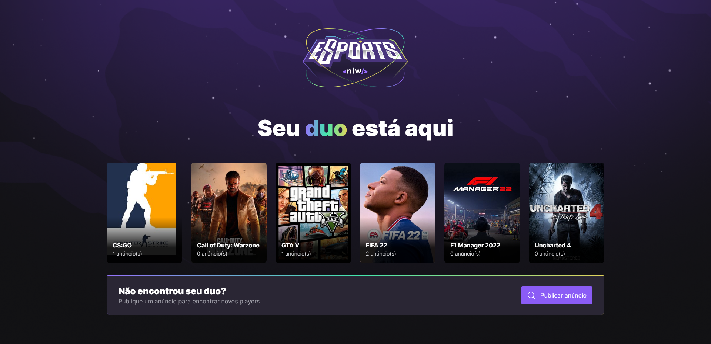
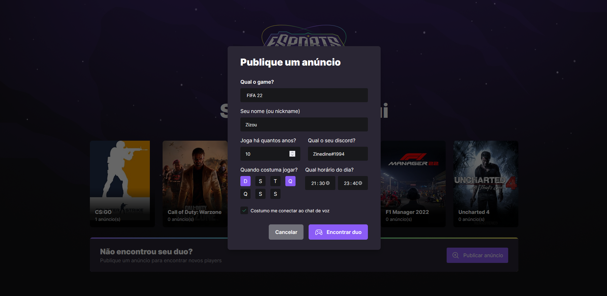
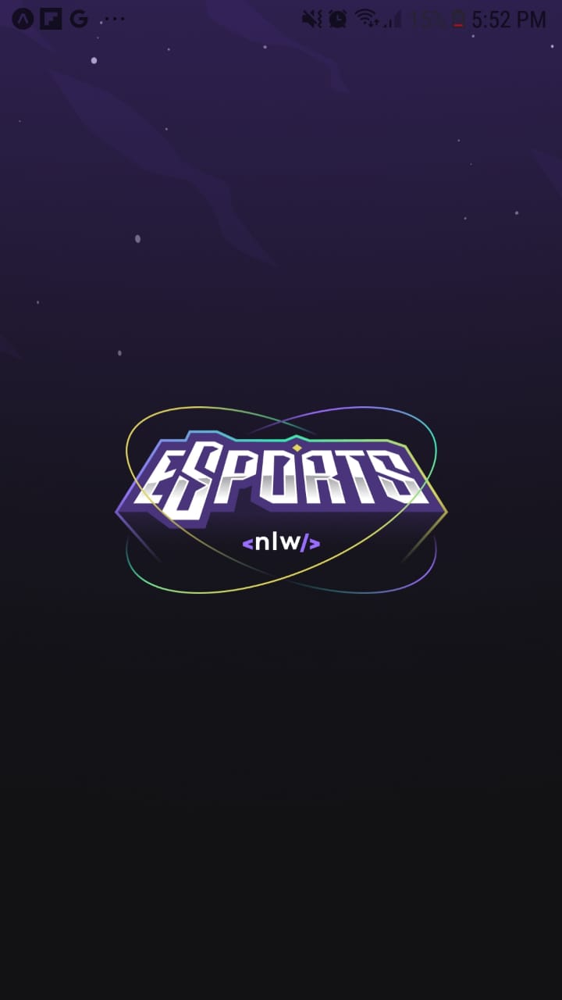
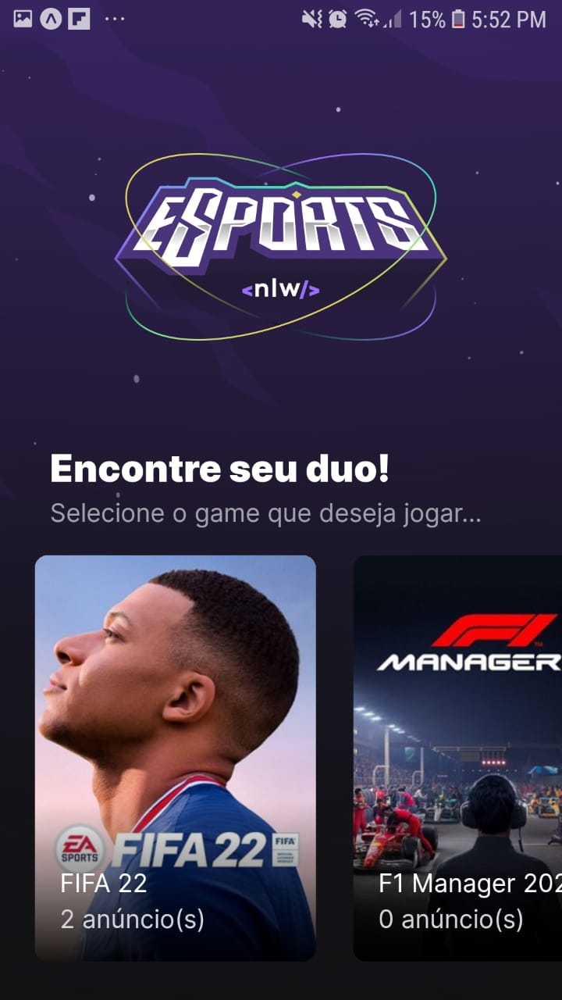
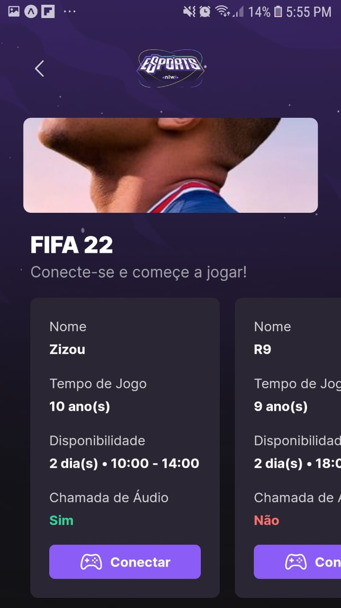
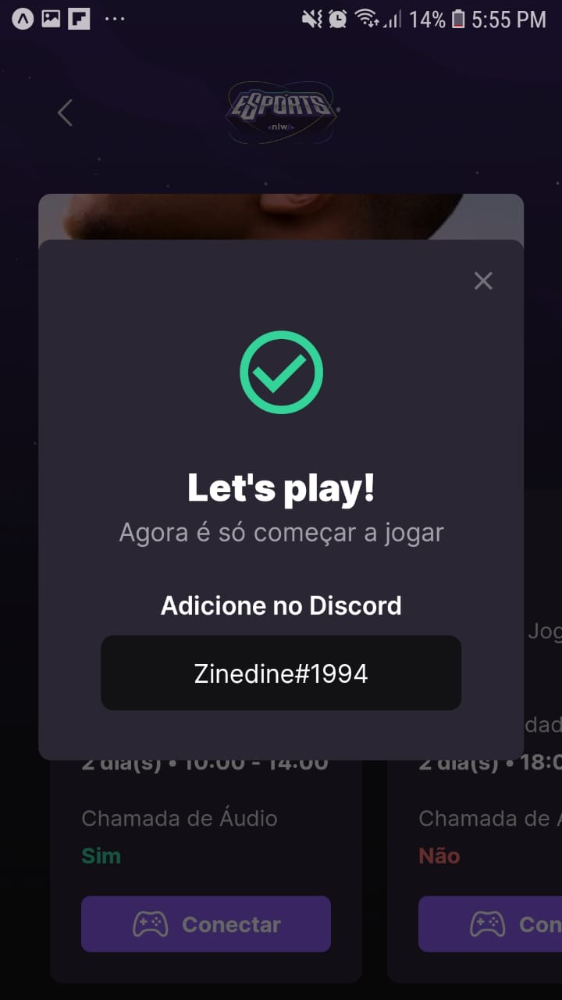

# *NLW eSports.*

<p align="right">
 

  
</p>

<br>

<p align="center">
  
</p>

## Projeto

*NLW eSports* é uma aplicação *Web* e *Mobile* para que os *gamers* possam criar anúncios relacionados aos seus *games* favoritos e divulgando seus *ID's* do *Discord*. Nesse sentido, os *players* podem encontrar os anúncios e ter acesso ao *Id* do *Discord* dos *players* com interesses em comum, para que possam se conectar e jogarem juntos.
Aplicação foi desenvolvida durante o *NLW eSports*, organizado pela [Rocketseat](https://www.rocketseat.com.br/).<br />

## Layout

### Web:
<p align="center">
 
 
</p>

### Mobile:
<p align="center">
 
 
 
 
</p>

## Tech Stack

### Web
- ReactJS
- Typescript
- Vite
- Tailwind
- Phosphor Icons
- Radix-ui
- Axios

### Mobile
- React-Native
- Typescript
- CSS
- Expo
- MaterialIcons

### Server
- NodeJS
- Typescript
- Prisma
- Insomnia

## Instalação

Você precisará ter instalado em sua máquina o [NodeJS](https://nodejs.org) e o [Expo CLI](https://docs.expo.dev/get-started/installation/). Em seu celular instale o [Expo Go](https://docs.expo.dev/get-started/installation/#2-expo-go-app-for-ios-and). Após realizar as instalações, você deve clonar este repositório executando no seu terminal o comando:
```bash
$ git clone https://github.com/luisfmaciel/NLW-eSports.git
```
Acesse no terminal o caminho de cada uma das pastas (server, web e mobile) presentes no repositório clonado e instale as dependências em cada um desses caminhos executando o seguinte comando:
```sh
  $ npm install
```

## Executando a aplicação

Acesse no terminal o caminho da pasta <b>server</b> e execute o comando a baixo para inicializar o servidor:
```sh
  $ npm run dev
```
Para inicializar a aplicação *Web*, acesse no terminal o caminho da pasta <b>web</b> e execute o seguinte comando:
```sh
  $ npm run dev
```
Para inicializar a aplicação *Mobile*, acesse no terminal o caminho da pasta <b>mobile</b> e execute o comando abaixo:
```sh
  $ expo start
```
Após inicializar a aplicação mobile, será gerado um QR Code no terminal. Execute em seu celular o Expo Go e leia o QR Code gerado.

## 📝 Licença

Esse projeto está sob a licença MIT. Veja o arquivo [LICENSE](/LICENSE.md) para mais detalhes.

---